# Методичні вказівки до виконання лабораторних робіт
*для студентів напряму підготовки 123 "Комп’ютерна інженерія" всіх форм навчання*

## Лабораторна робота №1. Виявлення вимог до функціональності програми. Розробка запитів зацікавлених осіб

**Мета:** вивчення вимог до програмного проекту, структури документів та
програмної системи, формування запитів зацікавлених осіб.

**Довідка**

Розробка концептуальної моделі предметної області є першим найважливішим етапом
розробки програмної системи, оскільки визначає узагальнене уявлення про
інформацію її кінцевих користувачів.

**Визначення цілі, перетворення системи**

База даних є частиною програмної системи, тому для її розробки необхідно
проаналізувати вимоги до системи в цілому.

**Послідовність дій:**

1.  Аналіз предметної області 

2.  Формування запитів зацікавлених осіб

**Запити зацікавлених осіб** – це опис вимог різних учасників проекту
(замовників, користувачів та ін.) до змісту системи, що містить організаційні
(призначення системи), функціональні (можливості системи) та експлуатаційні
аспекти.

**Структура документів:**

Дивись у ["Аналіз предметної області"](../docs/requirements/state-of-the-art.md) та ["Запити зацікавлених осіб"](../docs/requirements/stakeholders-needs.md).  

**Завдання:**

1. Провести аналіз предметної області

1. Визначити коло зацікавлених осіб

2. Визначити призначення розроблюваної системи за структурою списку запитів
зацікавлених осіб (компетенції, бізнес-сценарії та ін.)

## Питання для самостійної перевірки

1.  Які категоріі користувачів можуть приймати участь у проекті?

2.  Етапи розробки баз даних.

3.  Що означає "концептуальна модель"?

4.  Де визначаються ситуації, що не входять у список передумов?

## Лабораторна робота №2. Виявлення вимог до функціональності програми. Розробка моделі прецедентів

**Мета:** вивчення вимог до програмного проекту, структури документів та
програмної системи, формування моделі прецедентів.

**Довідка**

Розробка концептуальної моделі предметної області є першим найважливішим етапом
розробки програмної системи, оскільки визначає узагальнене уявлення про
інформацію її кінцевих користувачів.

**Визначення цілі, перетворення системи**

База даних є частиною програмної системи, тому для її розробки необхідно
проаналізувати вимоги до системи в цілому.

**Етапи розробки баз даних:**

2.  Діаграми Use Case

3.  Специфікація, сценарій, Sequence-діаграми

***Прецедент (англ. Use Case)*** – список етапів, що послідовно описує взаємодію
системи з користувачем та використовується для досягнення певної мети,
визначеної дійовою особою (англ. Actor).

Прецеденти слугують для документування функціональних вимог до програмних
систем. Описуючи деякий цілісний фрагмент поведінки системи, прецедент не
вдається в особливості внутрішньої структури суб’єкта. Визначення прецеденту
містить всі властиві йому види поведінки: основну послідовність, різноманітні
варіанти стандартної поведінки та різні виключні ситуації із зазначенням
відповідної реакції на них.

На діаграмах прецедентів в UML Use Case зображується у вигляді еліпса, всередині
якого (або під ним) вказується ім’я елемента.

До прецедентів в UML застосовні наступні види відношень:

- ***Асоціація (англ. Association)*** – вказує на те, що Actor ініціює відповідний
варіант використання.

- ***Розширення (англ. Extend)*** – різновид відношення залежності між базовим
варіантом використання та його частковим випадком.

- ***Включення (англ. Include)*** – визначає зв'язок базового варіанта використання
з іншим, функціональна поведінка якого завжди задіюється базовим варіантом.

- ***Узагальнення (англ. Generalization, наслідування)*** – моделює відповідну
спільність ролей.

***Actor*** – діюча особа (користувач, система, програма), спроможна приймати
рішення та взаємодіяти з розроблюваною системою.

***Діаграма Use Case*** – абстраговане представлення компонентів бази даних, дій та
зв’язків між ними.

***Специфікация*** - це формалізований опис властивостей, характеристик і функцій
об'єктів.

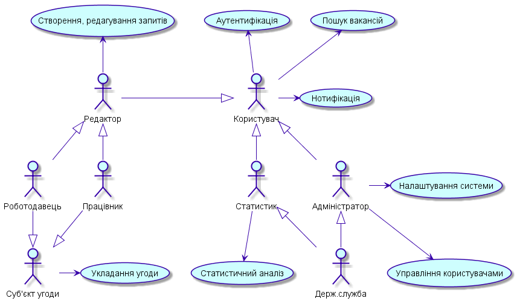

3. **Специфікація Use Case**

**ID** (ідентифікаційний номер, що присвоюється прецеденту при розробці системи)

**Назва** (власне, назва прецеденту)

**Учасники** (сторони, що діють за вказаним сценарієм)

**Передумови** (перелік дій, які необхідно виконати перед виконанням даного варіанту використання)

**Результати** (вихідні дані та зміна стану системи)

**Виключні ситуації** (ситуації, що суперечать виконанню передумов)

**Основний сценарій**

**Сутності** (найменші неподільні елементи проекту, що приймають участь у виконанні сценарію)

***Сценарій*** - послідовність дій, що мають бути виконані для досягнення
цілі, показує взаємодію Actor’a з системою у вигляді «користувач виконую дію
над системою» з вказанням результату, що повертає система. Зображується в
UML у вигляді діаграми Sequence.

Сценарій слугує основою для виділення сутності проекту.

**Приклад:**

*ID:* **UC_CreateRegCard**

*Назва:* Створення реєстраційної картки користувача

*Учасники:* Адміністратор, Система

*Передумова:* Адміністратор авторизований в системі

*Виключні ситуації:*

-   Адміністратор не авторизований

    1.  Завантажити сторінку авторизації

*Результат* Деактивована реєстраційна карта нового клієнта.

*Основний сценарій:*

1.  Адміністратор починає взаємодію.

2.  Система створює форму «Новий користувач».

3.  Адміністратор заповнює поля: ім’я, роль, адреса елеткронної пошти, текст
    запрошення.

4.  Система створює деактивовану реєстраційну картку нового користувача.

5.  Система генерує повідомлення запрошення користувача з URL для активації
    реєстраційної картки.

6.  Система пересилає повідомлення.

7.  Система генерує стан виконання операції.

8.  Адміністратор закінчує взаємодію.

*Діаграма:*


*Сутності:* Реєстраційна картка, ім’я, роль, адреса елеткронної пошти, текст
запрошення, повідомлення запрошення користувача, URL для активації реєстраційної
картки.

**Завдання:**

1.  На основі аналізу запитів зацікавлених осіб розробити загальну діаграму
    прецедентів

2.  Для кожного прецедента розробити специфікацію

**Питання для самостійної перевірки**

1.  Які категоріі користувачів можуть приймати участь у проекті?

2.  Що представляє собою діаграма Use Сase?

3.  Етапи розробки баз даних.

4.  Які види відношень застосовуються в UML

5.  Де ініціюється і закінчується процес взаємодії відповідно до сценарію
    прецедента?

6.  Яке зображення має прецедент на діаграмі UML?

7.  З яких частин складається специфікація Use Case?

8.  Де визначаються ситуації, що не входять у список передумов?

9.  Які повноваження може мати Actor?

10. На основі чого відбувається виділення сутностей проекту?

11. Яке призначення прецедентів?

12. Які стосунки можливі між актором і елементом Use Case?

## Лабораторна робота №3. Розробка моделі бізнес-об’єктів

**Мета:** Зрозуміти сутність бізнес-моделювання. Отримати навички розробки
моделі бізнес-об’єктів та словника предметної області.

**Довідка**

***Бізнес-моделювання (ділове моделювання)*** - діяльність з формування моделей
організацій, що включає опис ділових об'єктів (підрозділів, посад, ресурсів,
ролей, процесів, операцій, інформаційних систем, носіїв інформації і т.д.) і
вказівка зв'язків між ними. Вимоги до моделей, що формуються та їх відповідне
утримання визначаються цілями моделювання.

Бізнес-моделюванням також називають дисципліну і окремий підпроцес в процесі
розробки програмного забезпечення, в якому описується діяльність компанії та
визначаються вимоги до системи - ті підпроцеси та операції, що підлягають
автоматизації розробки в інформаційній системі.

***Бізнес-об’єкт*** представляє значну і постійну частину інформації, керованої
бізнес-акторами і виконавцями. Бізнес-об’єкти пасивні, тобто, вони не ініціюють
взаємодії самі по собі. Бізнес-об’єкт може бути використаний в безлічі різних
реалізацій бізнес-прецедентів і зазвичай реагує на будь-яку одиничну взаємодію.
Бізнес-об’єкти забезпечують основу для поділу інформації (потоку документів)
серед виконавців, що беруть участь в різних реалізаціях бізнес-прецедентів.

Бізнес-об’єкти являють абстракцію важливої постійної інформації в
бізнес-системі. Будь-яка частина інформації, яка є властивістю чого-небудь ще,
ймовірно не є бізнес-об’єктом в дійсності.

Бізнес-аналітик відповідає за ідентифікацію та опис бізнес-об’єктів, а також за
визначення впливу організаційних змін на інформацію, створену і необхідну
бізнес-системою. Бізнес-об’єкти також використовуються системними аналітиками та
дизайнерами при описі системних прецедентів та ідентифікації програмних об’єктів
відповідно.

Метою моделювання бізнес-об’єктів та їх станів є використання моделей
бізнес-об’єктів та їх станів при проектуванні переліку вхідних / вихідних
сигналів і даних, інтерфейсу користувача, баз даних (БД), класів, які реалізують
функції системи.

Бізнес-об’єкт (business entity), представляє абстракцію суті реального світу.
Прикладами бізнес-об’єктів можуть бути заявка на кредитування, договір, угода і
т.д.

Модель з описом бізнес-об’єктів повинна будуватися на основі опису бізнес-процесів. Бізнес-об’єкти 
повинні моделюватися в розбивці по бізнес-процесам. При
створенні програмної системи моделюватися повинні тільки бізнес-об’єкти,
пов'язані з діяльностями, що підлягають автоматизації.

Для створення опису документів / бізнес-об’єктів використовується компоненти
діаграми класів / функцій:

-   пакет (package);

-   бізнес сутність (business entity);

-   асоціативний зв'язок (association);

-   зв'язок агрегація (agregation);

-   зв'язок композиція (composition);

-   зв'язок спадкування або батько нащадок (generalization).

***Пакет*** використовується для групування бізнес об’єктів.

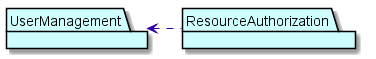

***Елемент бізнес-сутність***

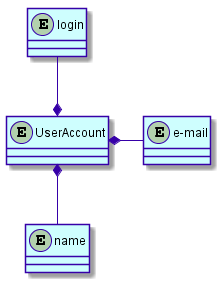

Бізнес-об’єкти можуть мати атрибути. При описі атрибутів можна зазначати:

-   назву атрибута;

-   тип атрибута;

-   стереотип атрибута;

-   початкове значення атрибута (опціонально);

-   правила формування атрибута;

-   приклади значень атрибута.

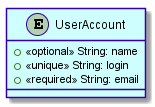

Для завдання типів атрибутів можуть використовуватися типи даних:

-   число;

-   символ;

-   дата;

-   час;

-   логічне значення;

-   об'єкт.

Тип даних «число» можна використовувати для опису чисел будь-якого виду,
наприклад, «число (10.3)». В дужках рекомендується зазначати загальна кількість
цифр числа і якщо потрібно, кількість цифр після крапки.

Тип даних символ можна використовувати для опису рядків символів, наприклад,
«символ (100)».

Тип даних «дата» можна використовувати для атрибутів, які є датами.

Тип даних «час» можна використовувати для атрибутів, які є часом.

Тип даних «логічне значення» можна використовувати для атрибутів, які можуть
приймати два значення, наприклад «істина», «брехня».

Тип даних «об'єкт» можна використовувати для атрибутів, що представляють великий
об'єкт, наприклад креслення, малюнок.

Початкове значення атрибута не є обов'язковим полем.

Якщо значення атрибута можуть задаватися елементом списку, або бути кандидатами
на довідники, словники, то в колонці таблиці початкове значення, пов'язаної з
цим атрибутом, можна зазначатися слово словник, довідник. Якщо атрибут має
початкове значення, то слово словник або довідник можна вказувати через кому
після значення атрибута за замовчуванням.

За атрибутам, за якими буде проводитися угруповання або сортування, наприклад,
для звітів, в описі початкових значень можна додатково вказувати слово параметр
угруповання або сортування.

Атрибути можуть задаватися елементом списку, бути кандидатами на словники,
довідники та одночасно бути атрибутом, за яким проводитиметься угруповання. В
цьому випадку за словом список, або словник, довідник через кому можна
використовувати слово параметр.

Якщо атрибут задається типом даних об'єкт, то початкове значення може задається
як ім'я файлу, в якому зберігатиметься об'єкт, наприклад, малюнок або креслення.

***Асоціативний зв'язок (association)*** між бізнес-сутностями (business entity) є
смисловий зв'язок. Зв'язок не пояснює, як сутності спілкуються один з одним,
відзначається тільки смислова залежність між ними. Асоціативний зв'язок
(association) зображується на діаграмі класів суцільний прямою лінією.

Асоціативний зв'язок може бути пойменований. Ім'я асоціації вказується, виходячи
з контексту. Рекомендується вказувати ім'я асоціації так, щоб воно читалося
коректно зліва направо або зверху вниз.

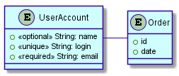

***Зв'язок композиція*** позначає зв'язок частина цілого (part of), де частина не може
існувати без цілого. Наприклад, журнал включає заголовок журналу і рядки
журналу.

Композиція (composition) зображується суцільною прямою лінією з додаванням на
кінці зафарбованого ромба:


***Зв'язок агрегація*** означає зв'язок частина цілого (part of), де частина може
існувати без цілого (контейнер).

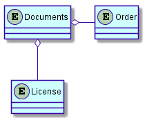

Кількість бізнес об’єктів, які беруть участь в зв'язку, називається потужністю
зв'язку. Потужність вказується на кожному кінці зв'язку. Потужність означає
число зв'язків між однією бізнес сутністю на початку лінії зв'язку з бізнес
сутностями в кінці лінії зв'язку.

Потужність зв'язку може позначатися таким чином:

-   1 - рівно одна бізнес сутність;

-   0 .. \* - нуль або більше бізнес об’єктів;

-   1 .. \* - одна або більше бізнес об’єктів;

-   0 .. 1 - нуль або одна бізнес сутність;

-   5 .. 8 - специфічний діапазон 5,6,7,8;

-   4 .. 7, 9 - комбінація 4,5,6,7, або 9 бізнес об’єктів.

Потужність зв'язку з боку зафарбованого ромба не слід вказувати, оскільки вона
завжди дорівнює 1 по нотації мови UML.

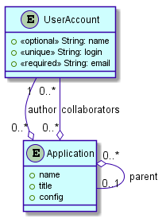

***Спадкування*** або зв'язок батько-нащадок (generalization) між бізнес об’єктами -
це таке відношення між ними, коли один бізнес-об’ект повторює структуру іншого
(одиночне спадкоємство) або декількох інших (множинне успадкування)
бізнес-об’єктів.

Зв'язок спадкування (generalization) не називається, на ній також не вказується
потужність.

На діаграмах класів спадкування (generalization) зображується стрілкою з не
зафарбовані трикутником, зверненим до об’єкта, від якої успадковуються
властивості.

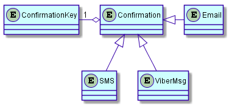

***Словник предметної області***

Основне завдання на цьому етапі сформувати однозначний термінологічний словник
для предметної області. Деякі об'єкти можна назвати різними словами, наприклад,
«Огляд книги» може мати на увазі те ж саме, що «Редакторський огляд» або «Огляд,
складені користувачем».

Модель предметної області постійно змінюється і повинна відображати поточне
розуміння предметної області.

З використанням словника предметної області має відбуватися спілкування між
учасниками робочої групи. Але модель предметної області краще, ніж словник. Вона
показує графічно, як терміни пов'язані між собою. Проте нам все одно потрібно
створювати словник предметої області, щоб визначити список термінів та їх
пояснень.

**Завдання**

1.Вивичити основні концепції бізнес моделювання. Вільно володіти термінологією:
бузнес-об’єкт, словник предметної області, їх сутність та призначення.

2.Виділити з Use CASE запити зацікавлених осіб.

3.Виділити об'єкти, над якими відбуівються дії, та їхні атрибути.

4.Визначити співвідношення між вище згаданими компонентами

5.Зробити розбивку на пакети, якщо це необхідно.

6.Побудувати діаграму бізнес-об’єктів.

7.Розробити словник предметної області.

**Питання для самостійної перевірки**

1.Що таке бізнес моделювання?

2.Призначення бізнес моделювання?

3.Де використовується?

4.Що таке бізнес-сутність?

5.Для чого використовується бізнес-сутність?

6.Як визначити бізнес-сутність?

7.Які існують зв’язки між бізнес-сутностями?

8.Що таке асоціативний зв’язок? Як він відображається?

9.Що таке зв’язок агрегація? Як він відображається?

10.Що таке зв’язок композиція? Як він відображається?

11.Що таке зв’язок спадкування? Як він відображається?

12.Що таке атрибути бізнес-сутості?

13.Для чого існують атрибути бізнес-об’єктів?

14.Що таке словник предметної області?

15. Для чого використовується словник предметної області?

# Лабораторна робота №4. Розробка реляційної схеми

**МЕТА:** Вивчення структури реляційних таблиць. Методи створення реляційної таблиці.

**ДОВІДКА**

**Реляційна модель даних** — логічна модель даних, що описує:

-   структури даних у вигляді наборів відношень, що, можливо, змінюються в часі;

-   теоретико-множинні операції над даними: об'єднання, перетин, різниця і
    декартів добуток;

-   спеціальні реляційні операції: селекція, проекція, з'єднання і розподіл;

-   а також спеціальні правила, що забезпечують цілісність даних.

Обробка даних в реляційній моделі ґрунтується на принципах реляційної алгебри.

Реляційна база даних — основана на реляційній моделі даних. Для роботи з
реляційними БД застосовують реляційні СКБД. Інакше кажучи, реляційна база даних
— це база даних, яка сприймається користувачем як набір нормалізованих відношень
різного ступеню.

**Відношення** має просту графічну інтерпретацію, воно може буде представлене у
вигляді таблиці, стовпці (поля, атрибути) якої відповідають входженням доменів у
відношення, а рядки (записи, кортежі) - наборам з n значень, що взяті з
початкових доменів. Кількість рядків n, називають кардинальним числом
відношення, або потужністю відношення.

Така таблиця має ряд властивостей:

-   В таблиці немає двох однакових рядків.

-   Таблиця має стовпці, відповідні атрибутам відношення.

-   Кожний атрибут у відношенні має унікальне ім'я.

-   Порядок рядків в таблиці довільний.

***Заголовок (схема) відношення*** — скінченна множина впорядкованих пар виду \<A,
T\>, де A називається іменем атрибута, а T означає ім'я деякого базового типу
або раніше визначеного домену. Всі імена атрибутів в заголовку мають бути
різними.

***Кортеж,*** відповідний заголовку — множина впорядкованих триплетів \<A, T, v\>, по
одному такому триплету для кожного атрибута в заголовку. Третій елемент – v –
триплета \<A, T, v\> має бути дозволеним значенням типу даних або домена T.
Через те, що імена атрибутів унікальні, вказувати домен в кортежі зайве.

***Тіло відношення*** — невпорядкована множина різних кортежів.

Реляційна таблиця має поля ID (ідентифікатор), тип даних, ключ. Зв’язки
створюються між первинним ключем (PK) и зовнішнім (FK). Зв'язок йде від
вторинного до первинного.

**Приклад**

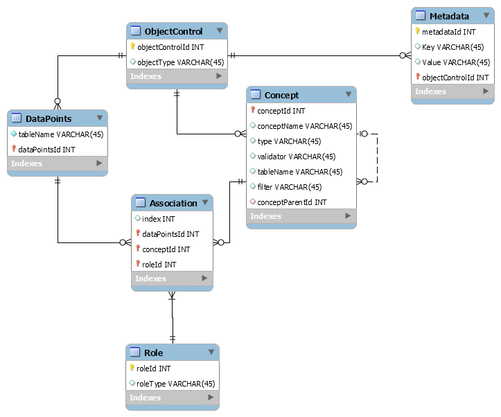

***Реляційна алгебра*** — відгалуження логіки першого порядку, множина відношень
замкнених операторами. Оператори застосовуються до відношень, в результаті
застосування отримується нове відношення.

В математиці, алгебра відношень є алгебраїчною структурою щодо математичної
логіки та теорії множин.

Подібно до інших алгебр, деякі оператори є примітивними, а інші, будучи
визначені через примітивні, є похідними від них. В реляційній алгебрі Кодда
визначено такі шість примітивних операторів: вибірка, проекція, декартів
добуток, об'єднання та різниця і перейменування.

Шість операторів є фундаментальними в тому сенсі, що жоден із них не можна
відкинути без втрати потужності. Багато інших операторів було визначено
комбінацією цих шести. Серед найважливіших можна назвати: перетин множин,
ділення та природнє об'єднання. Насправді, ISBL дала підстави для заміни
декартового добутку природнім об'єднанням, окремим випадком якого є декартів
добуток.

**Завдання**

1.  Вивчити реляційну модель даних, що вона описує, де використовується.

2.  Побудувати реляційну таблицю:

3.  Виходячи з діаграми бізнес об’єктів побудувати таблицю з відповідними
    назвами комірок.

4.  Відповідно до назви комірки назначити відповідний тип даних для кожної
    комірки.

5.  Назначити ключі в кожній таблиці, в яких потрібно створити зв’язки.

6.  Створити відношення між ключами.

**Питання для самостійної перевірки**

1.  Що таке реляційна модель даних.

2.  Структура реляційної моделі даних.

3.  Відношення в реляційній моделі.

4.  Призначення реляційних моделей в проектування БД.

5.  Призначення реляційної алгебри.

6.  Особливості реляційної алгебри.

7.  Розмітка реляційної таблиці.

8.  Нормальні форми в реляційній моделі даних.

#  Лабораторна робота №5. Реалізація бази даних засобами MySQL 

**МЕТА:** навчитися встановлювати та налаштовувати системи розробки баз даних MySQL та
Oracle SQL Developer.

**ДОВІДКА**

**Встановлення та налаштування серверу баз даних**

Сервер БД обслуговує базу даних і відповідає за цілісність і збереження даних, а
також забезпечує операції введення-виведення при доступі клієнта до інформації.

Архітектура клієнт-сервера складається з клієнтів і серверів. Основна ідея
полягає в тому, щоб розміщувати сервери на потужних машинах, а додаткам, що
використовують мовні компоненти СУБД, забезпечити доступ до них з менш потужних
машин-клієнтів за допомогою зовнішніх інтерфейсів.

Більшість СУБД використовують мову SQL (Structured Query Language - мова
структурованих запитів), так як вона зручна для опису логічних підмножин БД.

Призначення SQL:

-   Створення БД і таблиці з повним описом їх структури;

-   Виконання основних операцій маніпулювання даними (такі як вставка,
    модифікація і видалення даних з таблиць);

-   Виконання простих і складних запитів.

Одна з ключових особливостей мови SQL полягає в тому, що з її допомогою
формуються запити, що описують яку інформацію з бази даних необхідно отримати, а
шляхи вирішення цього завдання програма визначає сама.

**MySQL**

MySQL - вільна система управління базами даних (СКБД). MySQL є власністю
компанії Oracle Corporation, що отримала її разом з поглинанням Sun
Microsystems, що здійснює розробку і підтримку програми. Розповсюджується під
GNU General Public License або під власною комерційною ліцензією.

Гнучкість СУБД MySQL забезпечується підтримкою великої кількості типів таблиць:
користувачі можуть вибрати як таблиці типу MyISAM, що підтримують повнотекстовий
пошук, так і таблиці InnoDB, що підтримують транзакції на рівні окремих записів.
Більш того, СУБД MySQL поставляється із спеціальним типом таблиць EXAMPLE, що
демонструє принципи створення нових типів таблиць. Завдяки відкритій архітектурі
і GPL-ліцензуванню, в СУБД MySQL постійно з'являються нові типи таблиць.

MySQL портована на велику кількість платформ: AIX, BSDi, FreeBSD, HP-UX, Linux,
Mac OS X, NetBSD, OpenBSD, OS / 2 Warp, SGI IRIX, Solaris, SunOS, SCO
OpenServer, SCO UnixWare, Tru64, Windows 95, Windows 98, Windows NT, Windows
2000, Windows XP, Windows Server 2003, WinCE, Windows Vista і Windows 7.

MySQL має API для мов Delphi, C, C + +, Ейфель, Java, Лісп, Perl, PHP,
PureBasic, Python, Ruby, Smalltalk, Компонентний Паскаль і Tcl бібліотеки для
мов платформи. NET

**Oracle SQL Developer**

Oracle SQL Developer - інтегрована середа розробки на мовах SQL і PL / SQL,
орієнтована на застосування в середовищі Oracle Database. Корпорація Oracle
надає продукт безкоштовно. Сама середу написана на мові програмування Java,
працює на всіх платформах, де доступна середу виконання Java SE.

Для встановлення серверу потрібно завантажити файл інсталяції. Посилання на
файли:

MySQL:

-   [/](http://vk.com/away.php?to=http%3A%2F%2Fwww.mysql.ru%2Fdownload%2F)

-   <http://www.mysql.com/downloads/>

GUI:

-   <http://www.mysql.com/downloads/workbench/>

Oracle Developer Tool:

-   <http://www.oracle.com/technetwork/developer-tools/sql-developer/downloads/index.html>

**Приклад інсталяції**

Для встановлення MySQL:

1.  Завантажити з сайту [/](http://www.mysql.ru/download/) install-файл із
    розділу MySQL-5.1 /MySQL Community Server 5.1/ в залежності від параметрів
    системи.

2.  Для встановлення стандартного набору функцій в меню інсталяції обираємо
    пункт Typical-\>Next-\>Install

3.  Після інсталяції обираємо пункт *Configure the MySQL Server now-\>Finish*

4.  Для отримання стандартних налаштувань обираємо пункт Detailed
    configuration-\>Server Machine-\>Multifunctional Database

5.  Вказуємо адресу для зберігання налаштувань -\>Next-\>Decision Support

6.  Enable TCP\\IP Networking  
    

    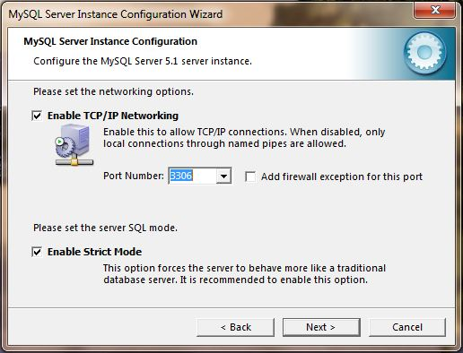

7.  Обираємо кодування Manual Selected Default Character Set  
    

    

8.  Next-\>Install as Windows Server-\> Next

9.  Обираємо параметр Modify Security Service, та вводимо свій пароль
    доступу-\>Next-\>Execute-\>Finish  
    

    

10. Запускаємо MySQL Command Line Client

11. Вводимо свій пароль.  
    

    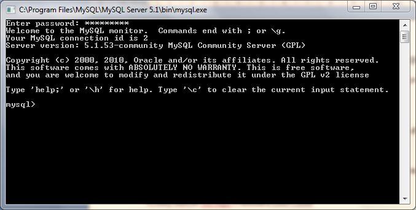

Для встановлення GUI:

1.  Завантажити з сайту <http://www.mysql.com/downloads/workbench/> install-файл
    в залежності від параметрів системи (Примітка. Для користувачів Windows
    система має бути Windows XP SP3 або вище).

2.  Для встановлення стандартного набору функцій в меню Setup Type обираємо
    пункт Complete -\> Next-\>Install-\>Finish.

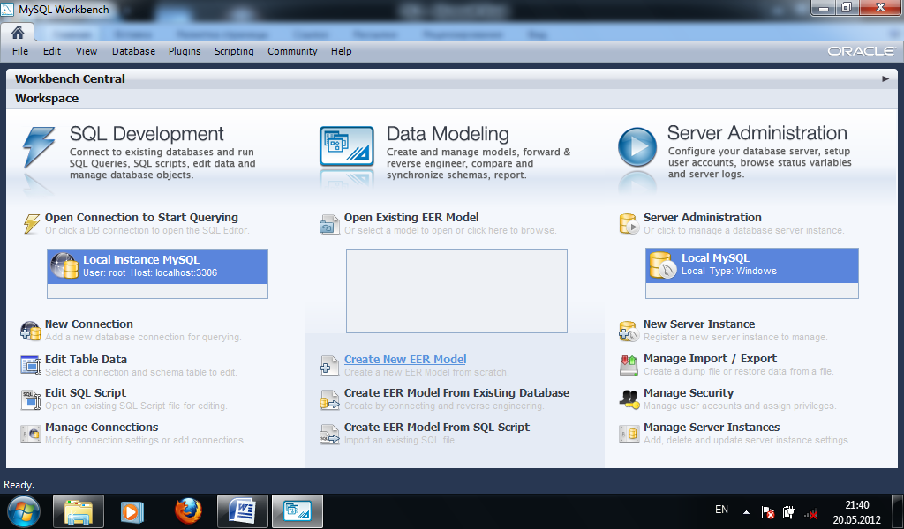

Для встановлення Oracle XE:

1.  Завантажити з сайту
    [html](http://www.oracle.com/technetwork/products/express-edition/downloads/index.html)
    архів з програмою інсталяції (Примітка. Для того, щоб мати змогу
    завантажити, потрібно зареєструватись на сайті Oracle).

2.  Розпакувати архів. Запустити програму інсталяції Setup.exe.

3.  Провести стандартну процедуру встановлення (вибір каталогу, де буде
    встановлена програма, підтвердження лінцензійної домовленості,тощо)

4.  У вікні Specify Database Passwords у вказане поле ввести свій унікальний
    пароль для бази даних.

Для встановлення Oracle Developer Tool:

1.  Завантажити з сайту
    [html](http://www.oracle.com/technetwork/developer-tools/sql-developer/downloads/index.html)
    архів з програмою (Примітка. Для того, щоб мати змогу завантажити, потрібно
    зареєструватись на сайті Oracle). Програма працює за умови,що на комп’ютері
    встановлена JDK 1.6.0_11 або вище. Завантажити JDK можна за цією адресою:
    <http://www.oracle.com/technetwork/java/javase/downloads/index.html>

2.  Розпакувати архів. Відкрити папку sqldeveloper з архіву і запустити файл
    sqldeveloper.exe. У вікні,що відкриється потрібно вказати повний шлях, за
    яким знаходиться виконавчий файл java.exe. Він знаходиться в папці, в якій
    встановлено Java (наприклад: C:\\Program Files\\Java\\jdk
    1.6.0_32\\bin\\java.exe).

**Мова структурованих запитів SQL**

SQL (англ. Structured query language — мова структурованих запитів) —
декларативна мова програмування для взаємодії користувача з базами даних, що
застосовується для формування запитів, оновлення і керування реляційними БД,
створення схеми бази даних і її модифікація, система контролю за доступом до
бази даних. Сам по собі SQL не є ні системою керування базами даних, ні окремим
програмним продуктом. Не будучи мовою програмування в тому розумінні, як C або
Pascal, SQL може формувати інтерактивні запити або, будучи вбудованою в
прикладні програми, виступати в якості інструкцій для керування даними. Стандарт
SQL, крім того, вміщує функції для визначення зміни, перевірки і захисту даних.

SQL — це діалогова мова програмування для здійснення запиту і внесення змін до
бази даних, а також управління базами даних. Багато баз даних підтримує SQL з
розширеннями до стандартної мови. Ядро SQL формує командна мова, яка дозволяє
здійснювати пошук, вставку, обновлення, і вилучення даних, використовуючи
систему управління і адміністративні функції. SQL також включає CLI (Call Level
Interface) для доступу і управління базами даних дистанційно.

***Data Definition Language (мова опису даних).*** За допомогою цієї мови визначають
дані, вказуючи тип даних, структури уявлення. Взагалі то це частина мови SQL,
але тільки одна. Це ті оператори, які пов'язані з командами створення, наприклад
CREATE TABLE. Результатом виконання цих операцій заноситися в системний каталог,
в якому зберігаються відомості про таблиці.

Функції мов DDL визначаються першим словом у реченні (часто званому запитом),
яке майже завжди є дієсловом. У випадку з SQL ці дієслова - «Create»
(«створити»), «Alter» («змінити»), «Drop» («видалити»). Це перетворює природу
мови в ряд обов'язкових тверджень (команд) до бази даних.

Оператор ***create table*** створює таблицю з заданим ім'ям у поточній базі даних.
Якщо немає активної поточної бази даних або зазначена таблиця вже існує, то
виникає помилка виконання команди.

У версії MySQL 3.22 і більш пізніх ім'я таблиці може бути вказано як
«db_name.tbl_name». Ця форма запису працює незалежно від того, чи є зазначена
база даних поточною. У версії MySQL 3.23 при створенні таблиці можна
використовувати ключове слово temporary. Тимчасова таблиця автоматично
видаляється після завершення з'єднання, а її ім'я дійсно тільки протягом даного
з'єднання. Це означає, що в двох різних з'єднаннях можуть використовуватися
тимчасові таблиці з однаковими іменами без конфлікту один з одним або з існуючою
таблицею з тим же ім'ям (існуюча таблиця прихована, поки не видалена тимчасова
таблиця).

У версії MySQL 3.23 і більш пізніх можна використовувати ключові слова IF NOT
EXISTS для того, щоб не виникала помилка, якщо зазначена таблиця вже існує. Слід
враховувати, що при цьому не перевіряється ідентичність структур цих
таблиць.Кожна таблиця tbl_name представлена певними файлами в директорії бази
даних.

Оператор ***Drop table*** видаляє одну чи кілька таблиць. 
```
DROP TABLE [IF EXISTS] tbl_name [, tbl_name, ...] [RESTRICT \| CASCADE]
```
Всі табличні дані і визначення видаляються, так що будьте уважні при роботі з цією командою!

У версії MySQL 3.22 і більш пізніх можна використовувати ключові слова IF
EXISTS, щоб попередити помилку, якщо зазначені таблиці не існують.

Опції RESTRICT і CASCADE дозволяють спростити перенесення програми. В даний
момент вони не задіяні.

Примітка: DROP TABLE автоматично приймає поточну активну транзакцію.

Оператор ***Alter table*** забезпечує можливість змінювати структуру існуючої
таблиці.Наприклад, можна додавати або видаляти стовпці, створювати або знищувати
індекси або перейменовувати стовпці або саму таблицю. Можна також змінювати
коментар для таблиці і її тип. Якщо оператор ALTER TABLE використовується для
зміни визначення типу стовпця, але DESCRIBE tbl_name показує, що стовпець не
змінився, то, можливо, MySQL ігнорує дану модифікацію по одній з причин,
Наприклад, при спробі змінити стовпець VARCHAR на CHAR MySQL буде продовжувати
використовувати VARCHAR, якщо дана таблиця містить інші стовпці з змінною
довжиною.

Оператор ALTER TABLE під час роботи створює тимчасову копію вихідної
таблиці.Необхідний зміна виконується на копії, потім вихідна таблиця
віддаляється, а нова перейменовується. Так робиться для того, щоб в нову таблицю
автоматично потрапляли всі оновлення крім невдалих. Під час виконання ALTER
TABLE вихідна таблиця доступна для читання іншими клієнтами. Операції поновлення
і записи в цій таблиці припиняються, поки не буде готова нова таблиця.

Слід зазначити, що при використанні будь-якої іншої опції для ALTER TABLE крім
RENAME, MySQL завжди буде створювати тимчасову таблицю, навіть якщо дані, строго
кажучи, і не потребують копіюванні (наприклад, при зміні імені стовпця). Ми
плануємо виправити це в майбутньому, однак, оскільки ALTER TABLE виконується не
так часто, ми (розробники MySQL) не вважаємо це завдання першочергове. Для
таблиць MyISAM можна збільшити швидкість відтворення індексного частини (що є
найбільш повільною частиною в процесі відновлення таблиці) шляхом установки
змінної myisam_sort_buffer_size досить великого значення.

**Приклад**


**Скрипт**
```sql
-- MySQL Workbench Forward Engineering
SET \@OLD_UNIQUE_CHECKS=\@\@UNIQUE_CHECKS, UNIQUE_CHECKS=0;
SET \@OLD_FOREIGN_KEY_CHECKS=\@\@FOREIGN_KEY_CHECKS, FOREIGN_KEY_CHECKS=0;
SET \@OLD_SQL_MODE=\@\@SQL_MODE, SQL_MODE='TRADITIONAL,ALLOW_INVALID_DATES';
-- -----------------------------------------------------
-- Schema DataManagementSystem
-- -----------------------------------------------------
DROP SCHEMA IF EXISTS `DataManagementSystem` ;
-- -----------------------------------------------------
-- Schema DataManagementSystem
-- -----------------------------------------------------
CREATE SCHEMA IF NOT EXISTS `DataManagementSystem` DEFAULT CHARACTER SET utf8
;
USE `DataManagementSystem` ;
-- -----------------------------------------------------
-- Table `DataManagementSystem`.`ObjectControl`
-- -----------------------------------------------------
DROP TABLE IF EXISTS `DataManagementSystem`.`ObjectControl` ;
CREATE TABLE IF NOT EXISTS `DataManagementSystem`.`ObjectControl` (
`objectControlId` INT NOT NULL AUTO_INCREMENT,
`objectType` VARCHAR(45) NULL,
PRIMARY KEY (`objectControlId`),
UNIQUE INDEX `objectControlId_UNIQUE` (`objectControlId` ASC))
ENGINE = InnoDB;
-- -----------------------------------------------------
-- Table `DataManagementSystem`.`Metadata`
-- -----------------------------------------------------
DROP TABLE IF EXISTS `DataManagementSystem`.`Metadata` ;
CREATE TABLE IF NOT EXISTS `DataManagementSystem`.`Metadata` (
`metadataId` INT NOT NULL AUTO_INCREMENT,
`Key` VARCHAR(45) NULL,
`Value` VARCHAR(45) NULL,
`objectControlId` INT NOT NULL,
PRIMARY KEY (`metadataId`, `objectControlId`),
INDEX `fk_Metadata_ObjectControl_idx` (`objectControlId` ASC),
UNIQUE INDEX `metadataId_UNIQUE` (`metadataId` ASC),
CONSTRAINT `fk_Metadata_ObjectControl`
FOREIGN KEY (`objectControlId`)
REFERENCES `DataManagementSystem`.`ObjectControl` (`objectControlId`)
ON DELETE NO ACTION
ON UPDATE NO ACTION)
ENGINE = InnoDB;
-- -----------------------------------------------------
-- Table `DataManagementSystem`.`DataPoints`
-- -----------------------------------------------------
DROP TABLE IF EXISTS `DataManagementSystem`.`DataPoints` ;
CREATE TABLE IF NOT EXISTS `DataManagementSystem`.`DataPoints` (
`tableName` VARCHAR(45) NOT NULL,
`dataPointsId` INT NOT NULL,
PRIMARY KEY (`dataPointsId`),
UNIQUE INDEX `dataPointsId_UNIQUE` (`dataPointsId` ASC),
UNIQUE INDEX `tableName_UNIQUE` (`tableName` ASC),
CONSTRAINT `fk_DataPoints_ObjectControl1`
FOREIGN KEY (`dataPointsId`)
REFERENCES `DataManagementSystem`.`ObjectControl` (`objectControlId`)
ON DELETE NO ACTION
ON UPDATE NO ACTION)
ENGINE = InnoDB;
-- -----------------------------------------------------
-- Table `DataManagementSystem`.`Concept`
-- -----------------------------------------------------
DROP TABLE IF EXISTS `DataManagementSystem`.`Concept` ;
CREATE TABLE IF NOT EXISTS `DataManagementSystem`.`Concept` (
`conceptId` INT NOT NULL,
`conceptName` VARCHAR(45) NULL,
`type` VARCHAR(45) NULL,
`validator` VARCHAR(45) NULL,
`tableName` VARCHAR(45) NULL,
`filter` VARCHAR(45) NULL,
`conceptParentId` INT NULL,
PRIMARY KEY (`conceptId`),
INDEX `fk_Concept_Concept1_idx` (`conceptParentId` ASC),
UNIQUE INDEX `conceptId_UNIQUE` (`conceptId` ASC),
UNIQUE INDEX `conceptName_UNIQUE` (`conceptName` ASC),
CONSTRAINT `fk_Concept_ObjectControl1`
FOREIGN KEY (`conceptId`)
REFERENCES `DataManagementSystem`.`ObjectControl` (`objectControlId`)
ON DELETE NO ACTION
ON UPDATE NO ACTION,
CONSTRAINT `fk_Concept_Concept1`
FOREIGN KEY (`conceptParentId`)
REFERENCES `DataManagementSystem`.`Concept` (`conceptId`)
ON DELETE NO ACTION
ON UPDATE NO ACTION)
ENGINE = InnoDB;
-- -----------------------------------------------------
-- Table `DataManagementSystem`.`Role`
-- -----------------------------------------------------
DROP TABLE IF EXISTS `DataManagementSystem`.`Role` ;
CREATE TABLE IF NOT EXISTS `DataManagementSystem`.`Role` (
`roleId` INT NOT NULL,
`roleType` VARCHAR(45) NULL,
PRIMARY KEY (`roleId`),
UNIQUE INDEX `roleId_UNIQUE` (`roleId` ASC))
ENGINE = InnoDB;
-- -----------------------------------------------------
-- Table `DataManagementSystem`.`Association`
-- -----------------------------------------------------
DROP TABLE IF EXISTS `DataManagementSystem`.`Association` ;
CREATE TABLE IF NOT EXISTS `DataManagementSystem`.`Association` (
`index` INT NULL,
`dataPointsId` INT NOT NULL,
`conceptId` INT NOT NULL,
`roleId` INT NOT NULL,
PRIMARY KEY (`dataPointsId`, `conceptId`, `roleId`),
INDEX `fk_Association_Concept1_idx` (`conceptId` ASC),
INDEX `fk_Association_Role1_idx` (`roleId` ASC),
CONSTRAINT `fk_Association_DataPoints1`
FOREIGN KEY (`dataPointsId`)
REFERENCES `DataManagementSystem`.`DataPoints` (`dataPointsId`)
ON DELETE NO ACTION
ON UPDATE NO ACTION,
CONSTRAINT `fk_Association_Concept1`
FOREIGN KEY (`conceptId`)
REFERENCES `DataManagementSystem`.`Concept` (`conceptId`)
ON DELETE NO ACTION
ON UPDATE NO ACTION,
CONSTRAINT `fk_Association_Role1`
FOREIGN KEY (`roleId`)
REFERENCES `DataManagementSystem`.`Role` (`roleId`)
ON DELETE NO ACTION
ON UPDATE NO ACTION)
ENGINE = InnoDB;
```

***Data Manipulation Language (мова управління (маніпулювання) даними).*** Це мова
керування даними, за допомогою якого можна витягувати і змінювати дані. 

Для ***вибірки даних*** з БД використовується запит ```SELECT```. Він дозволяє робити
вибірку потрібних даних з таблиць і перетворювати до потрібного виду отримані
результати. У загальному випадку результатом реалізації запиту ```SELECT```, є інша
таблиця, яку будемо називати таблицею результатів запиту (ТРЗ). До цієї нової
(робочої) таблиці може бути знову застосовано запит ```SELECT```, і т.д., тобто такі
операції можуть бути вкладені одна в одну.

Таблиця "Persons":

| P_Id | LastName  | FirstName | Address      | City      |
|------|-----------|-----------|--------------|-----------|
| 1    | Hansen    | Ola       | Timoteivn 10 | Sandnes   |
| 2    | Svendson  | Tove      | Borgvn 23    | Sandnes   |
| 3    | Pettersen | Kari      | Storgt 20    | Stavanger |

Тепер ми хочемо вибрати зміст колонок під назвою "*LastName* " та "*FirstName*"
з таблиці вище.

Ми використаємо команду SELECT таким чином:
```sql
SELECT LastName,FirstName FROM Persons
```
В результаті отримаємо:

| LastName  | FirstName |
|-----------|-----------|
| Hansen    | Ola       |
| Svendson  | Tove      |
| Pettersen | Kari      |

Таблиця "Persons":

| P_Id | LastName  | FirstName | Address      | City      |
|------|-----------|-----------|--------------|-----------|
| 1    | Hansen    | Ola       | Timoteivn 10 | Sandnes   |
| 2    | Svendson  | Tove      | Borgvn 23    | Sandnes   |
| 3    | Pettersen | Kari      | Storgt 20    | Stavanger |
| 4    | Nilsen    | Johan     | Bakken 2     | Stavanger |
| 5    | Tjessem   | Jakob     |              |           |

Тепер ми хочемо оновити персону " TjessemJakob " в таблиці " Persons ".

Ми використовуємо такі команди SQL:
```sql
UPDATE Persons  
SET Address='Nissestien 67', City='Sandnes'  
WHERE LastName='Tjessem' AND FirstName='Jakob'
```
В результаті отримаємо:

| P_Id | LastName  | FirstName | Address       | City      |
|------|-----------|-----------|---------------|-----------|
| 1    | Hansen    | Ola       | Timoteivn 10  | Sandnes   |
| 2    | Svendson  | Tove      | Borgvn 23     | Sandnes   |
| 3    | Pettersen | Kari      | Storgt 20     | Stavanger |
| 4    | Nilsen    | Johan     | Bakken 2      | Stavanger |
| 5    | Tjessem   | Jakob     | Nissestien 67 | Sandnes   |

Таблиця "Persons":

| P_Id | LastName  | FirstName | Address      | City      |
|------|-----------|-----------|--------------|-----------|
| 1    | Hansen    | Ola       | Timoteivn 10 | Sandnes   |
| 2    | Svendson  | Tove      | Borgvn 23    | Sandnes   |
| 3    | Pettersen | Kari      | Storgt 20    | Stavanger |

Треба вставити новий рядок в таблицю "Persons".
```sql
INSERT INTO Persons  
VALUES (4,'Nilsen', 'Johan', 'Bakken 2', 'Stavanger')
```
В результаті отримаємо:

| P_Id | LastName  | FirstName | Address      | City      |
|------|-----------|-----------|--------------|-----------|
| 1    | Hansen    | Ola       | Timoteivn 10 | Sandnes   |
| 2    | Svendson  | Tove      | Borgvn 23    | Sandnes   |
| 3    | Pettersen | Kari      | Storgt 20    | Stavanger |
| 4    | Nilsen    | Johan     | Bakken 2     | Stavanger |

**Завдання**

Вивчити основи мови структурних запитів SQL, недоліки та переваги мови, цілі
створення, стандарт-ревізії, сумісність мови.

Детально вивчити основні команди SQL та їх особливості. Вільно володіти такими
командами Select, Insert, Update.

Створити базу даних. Виконати зміну бази по варіанту.

**Питання для самостійної перевірки**

1. Дайте визначення SQL?

2. Чи є SQL мовою програмування?

3. Перелічите основні завдання й функції SQL

4. DDL дайте визначення й назвіть характерні риси

5. DML призначення й принципи

6. Які різновиди DML мови ви знаєте?

7. Які є об'єкти в БД?

8. Назвіть основні функції операторів Create, Drop й Alter

9. Приведіть приклад синтаксису операторів Create, Drop й Alter

10.  Коротка характеристика команди SELECT, її особливості.

11.  Коротка характеристика команди UPDATE, її особливості.

12.  Коротка характеристика команди INSERT, її особливості.

# Лабораторна робота №6. Реалізація об’єктно-реляційного відображення

**МЕТА:**
Отримання навичок зі створення DAO-інфраструктури для доступу до MySQL баз
даних.

**ДОВІДКА**

***DAO*** - об'єкт що надає абстрактний інтерфейс до деяких видів баз даних чи
механізмів персистентності реалізуючи певні операції без розкриття деталей бази
даних. Він надає відображення від програмних викликів до рівня персистентності.
Така ізоляція розділює запити до даних в термінах предметної області та їх
реалізацію засобами СКБД.

Персистентність - здатність стану існувати довше, ніж процес, що створив його.
Без цієї можливості, стан може існувати лише в оперативній пам'яті і
втрачається, коли оперативна пам'ять вимикається, наприклад, при вимкненні
комп'ютера.


***Active Record*** - це шаблон проектування, що використовується при реалізації доступу до реляційних баз даних. Вперше згадується Мартіном Фаулером в книжці Patterns of Enterprise Application Architecture. Цей шаблон є підвидом DAO, але навідміну від нього, він надає CRUD API кожному окремому об'єкту, який репрезентує окремий запис в таблиці БД.

**Завдання**

1. Ознайомитись з призначенням шаблону Data Access Object

2. Створити базу даних у MySQL

3. Створити bean-класи по одному для кожної таблиці, які складаються з опису
одного рядка таблиці.

4. Розробити DAO-інфраструктуру для роботи з базою даних.

5. Розробити програму для тестування можливостей DAO, яка створює деякі об’єкти
в кожній таблиці та шукає існуючи їх по деяким ознакам.

6. Запустити програму та продивитись результати її роботи у MySQL.

**Питання для самостійної перевірки**

1. Яке основне призначення DAO

2. Які три основні можливі реалізації механізму в Java

3. Які переваги від розділення реалізації роботи з СКБД та прозорою роботою з
даними в програмі
